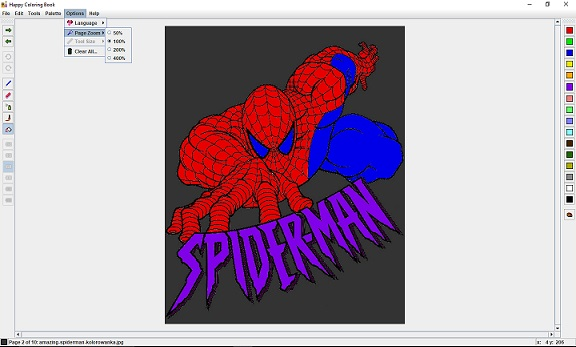

#  Happy Coloring Book
✏️🎨 Coloring book application for every operating system where Java SE is avaible. Take your stress off by coloring images. 😃

## Description
Similiar application like in my xmas-colorbook repository - except designed to use with your own images. Downloads are [*here*](https://github.com/tstamborski/happy-coloring-book/releases/download/v0.5/HappyColoring.jar).

## Screenshots

## Useful links
* Java software for your operating system (if this program doesn't start and you are some less technical/computer man, then probably you haven't installed Java):
  - [java.com](https://www.java.com/download)
* Websites where you can find free images to coloring:
  - [supercoloring.com](https://www.supercoloring.com)
  - [crayola.com](https://www.crayola.com/featured/free-coloring-pages/)

## Some other things to notice
* Application currently does not offer any builded-in images to coloring - I am planning to make some few in future,
but for now you must download some nice images to coloring for your own.
* If you are curious where it makes its autosave - look for `.HappyColoring` directory in your user home dir (just
you must enable `show hidden files` option in your file manager). Yes, I know most of people here would thinked this
very fast, but I also know some who was a bit confused.
* Yes this program can easily gets foolish if you use two or more images with exactly the same name (even when they are
in separate directories). Maybe it was a bad idea to make such autosave feature, but for now it simply works like that and
simply look at names of your coloring images - rename one if you have problems.
* Mouse wheel works as a darkening or lightening current color.
* Right mouse button works as a pipette tool - right click to get color from place under cursor.
* Application currently have two language versions - english 🇬🇧 and polish 🇵🇱 (and they are not 100% finished yet).
